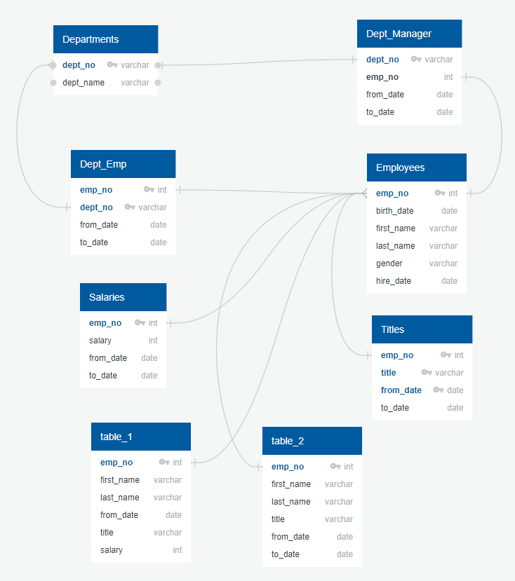

# Pewlett-Hackard-Analysis
# Challenge

Purpose 
--
The company is aware that a lot of employees will be retiring in the near future and the problem is that the employee data is not up to date and does not track employees that may retire soon. The purpose of this assignment was to determine the total number of employees per title who will be retiring and which ones are eligible for the mentorship program.

Steps & Challenges
--
For the first table, I used the current_emp, titles, and salaries tables and used two inner joins to combine the data. The challenge I came across in this step was that some of the employees were duplicated because as their title within the company changed, a new dataline was created to track their new title and still have the historic data of their old title. To remove the duplicates, I used a partition to only return the latest data of an employee when more than one data line for that employee existed. This only returned the newest employee information and had the correct title.

For the second table, I used the employees and titles tables and used a single inner join to combine the data where the employee's birthdate was between Jan 1, 1965 and Dec 31, 1965 and they must be currently employed. These were the requirements for the mentorship program

One of the challenges I faced for both tables was remembering all the data I had within each table. The ERD I created helped me view the relationships between the tables and what data existed within each table but did not show me if all the data was clean as in the instance of the duplicated data lines. One method I used to solved this was by selecting all the data from the tables I wanted to look at and seeing what existed in the table with the query tool. 

Results, Limitations, and Next Steps
--
The number of employees retiring is 33118 and the number of individuals being hired to fill those roles would be the same, 33118. 
The number of employees available for the mentorship role is 1549.
One limitation of the data is that people do retire at different ages so this exercise and analysis is helpful for giving a general idea of who may retire, however, is not accurate. 
One recommendation for further analysis on this dataset is looking at the number of people retiring based on the department. This would help the company understand which departments will be undergoing the most change in the near future and prepare for it.

Below is the image of the ERD I created according to the module lessons, updated to include the two tables created for the challenge.

